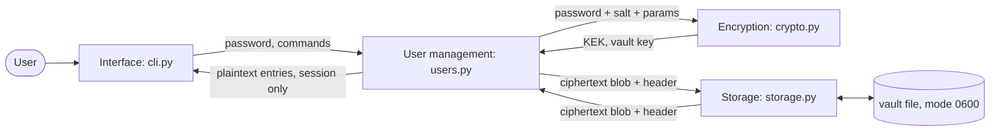

# Checkpoint 1: Threat Model and Architecture (Password Manager)

## 1. Assumptions and scope

Complete local, offline, and single-user CLI application written in Python 3.11+. The user's sensitive information is stored in a single encrypted vault file. "User management" therefore means the lifecycle of the user's master credential (create, unlock, change, lock) and the unlocked session, instead of multiple accounts.

**Adversaries considered**
- A1: One who obtains a copy of the vault file (stolen laptop, leaked backup, etc.).
- A2: A local and unprivileged attacker/process on the same machine while the user is logged in.
- A3: A shoulder-surfer/one with temporary physical access to an unlocked terminal.

**Out of scope:** root/kernel malware, keyloggers, cold-boot and hardware attacks, etc. These are stated as other residual risks in section 4.

**Assets:** (1) the stored credentials, (2) the master password, (3) vault integrity (no undetected modification).

## 2. Architecture

Four components. Only three carry security logic; the CLI is a thin shell.

| Module | File | Responsibility | Must never |
|---|---|---|---|
| Interface | `cli.py` | Parse commands, prompt for secrets (no echo), print results, clipboard handling | Perform crypto or file I/O directly |
| User management | `users.py` | Create vault, unlock, change master password, session state, idle timeout, failed-attempt back-off | Touch the file format or ciphers |
| Encryption | `crypto.py` | Argon2id KDF, AES-256-GCM, key wrapping, RNG, key wiping | Read or write files |
| Storage | `storage.py` | Parse and validate the file, atomic writes, backups, permissions | See plaintext or keys |



**Data flow: unlock.** CLI reads the password without echo, then passes it to `users.unlock`. `users` gets the header from `storage`, then asks `crypto` to derive the KEK (Argon2id) and unwrap the vault key. It then fetches the ciphertext from `storage`, has `crypto` decrypt it, and holds the entries in a `Session`. Plaintext and keys exist only inside `Session`.

**Data flow: save.** After a mutation, `users` serialises entries, `crypto` encrypts them with a fresh nonce, and `storage` writes the file atomically.

Trust boundary: everything to the left of `storage` handles secrets; everything beyond it is considered untrusted.

## 3. Design decisions: vault format and cryptography

### 3.1 Key hierarchy

```
master password --Argon2id(salt, params)--> KEK (32 B)
KEK --AES-256-GCM unwrap--> vault key VK (32 B, random, generated once at init)
VK  --AES-256-GCM--> vault contents
```

Rationale for the two-level scheme: changing the master password only re-derives the KEK and re-wraps the 32-byte VK, and the vault body is not touched. It also allows future extras (e.g. a recovery key wrapping the same VK) without changing the format.

### 3.2 Primitives

| Purpose | Choice | Why |
|---|---|---|
| Password hashing / KDF | **Argon2id**, m = 64 MiB, t = 3, p = 1, 16 B random salt, 32 B output | Memory-hard, resists GPU/ASIC brute force; parameters are stored in the header so they can be raised later. Minimum accepted parameters are enforced on load to prevent downgrade. |
| Encryption | **AES-256-GCM**, 96-bit random nonce, fresh per encryption | Authenticated encryption (confidentiality + integrity). With a random nonce and a fresh one on every save, the collision risk is negligible for a personal vault. |
| RNG | `os.urandom` / `secrets` | OS CSPRNG. |
| Library | `cryptography` (AEAD) and `argon2-cffi` (KDF) | Vetted implementations; no home-made primitives. |
| Password generation | `secrets.choice` over a chosen alphabet | Uniform, unbiased selection. |

### 3.3 File format (version 1)

A single JSON file (UTF-8) for easy inspection and versioning. Binary fields are base64.

```json
{
  "magic": "PWM-VAULT",
  "version": 1,
  "kdf": { "alg": "argon2id", "m_kib": 65536, "t": 3, "p": 1, "salt": "<b64 16B>" },
  "wrapped_key": { "alg": "aes-256-gcm", "nonce": "<b64 12B>", "ct": "<b64 48B>" },
  "body": { "alg": "aes-256-gcm", "nonce": "<b64 12B>", "ct": "<b64 ...>" }
}
```

- **Associated data (AAD):** `magic || version || canonical kdf block` is authenticated in both the wrapped key and the body, so header tampering (version or KDF-parameter changes) is detected.
- **Body plaintext:** one JSON document `{ "entries": [ {id, name, username, password, url, notes, tags, created, modified} ], "counter": n }`. The whole body is encrypted as one blob, so entry names, counts and sizes are not exposed individually (only the total size).
- **Write path:** serialise, write to a temp file in the same directory, `fsync`, copy the old file to `.bak`, then atomic `rename`; permissions 0600. This prevents corruption on crash.
- **Wrong password vs. corruption:** both surface as one generic "cannot unlock" error, so no oracle for which one occurred is provided.

## 4. Threat model

Each row: threat, mitigation, residual risk.

### 4.1 Master password

| # | Threat | Mitigation | Residual risk |
|---|---|---|---|
| M1 | Offline brute force / dictionary attack on a stolen vault (A1) | Argon2id with 64 MiB memory cost; per-vault random salt; strength check at `init`/`passwd` (minimum length 12, reject common-password list); encourage passphrases | A weak but accepted password can still fall; cost is raised, not eliminated |
| M2 | Online guessing at the CLI (A2, A3) | Exponential back-off after failed unlocks within a session; Argon2 cost makes each try slow | Attacker can call the program repeatedly; no lock-out state kept on disk in v1 |
| M3 | Password leaks through command line, shell history or process list | Password only ever read from a no-echo prompt (`getpass`); never accepted as argv or env variable | Malware/keylogger (out of scope) |
| M4 | Password lingers in memory after use | Held in a `bytearray`, wiped straight after key derivation | Python may create copies during input handling (see V2) |
| M5 | Forgotten password | No backdoor by design; documented in README | Permanent data loss if forgotten |

### 4.2 Vault at rest

| # | Threat | Mitigation | Residual risk |
|---|---|---|---|
| R1 | File theft reveals secrets (A1) | AES-256-GCM over the whole body; key derived from the master password only | See M1 |
| R2 | Tampering or bit rot (edit ciphertext, swap fields) | GCM tag on body and wrapped key; header bound as AAD; fail closed with a generic error | Denial of service by deletion/corruption |
| R3 | KDF downgrade (attacker lowers Argon2 parameters in the header) | Parameters authenticated as AAD; enforced minimum parameters on load | None significant |
| R4 | Rollback to an older valid vault | Not prevented in v1 (documented); `.bak` kept locally; counter field stored for a possible future check | Accepted: an attacker with write access can restore an old version |
| R5 | Crash during save corrupts the vault | Temp file + fsync + atomic rename; `.bak` retained | Disk-level failure |
| R6 | Other local users read the file (A2) | Created with mode 0600 inside a 0700 directory | Root, or a same-user process |
| R7 | Metadata leakage (entry names, counts) | Names live inside the encrypted body; only total size is visible | File size and modification time |
| R8 | Nonce reuse | Fresh random 96-bit nonce per encryption; VK can be rotated | Negligible at personal scale |

### 4.3 Vault in memory

| # | Threat | Mitigation | Residual risk |
|---|---|---|---|
| V1 | Secrets remain after the session ends (A2, A3) | Explicit `Session.lock()` wiping keys and entries; idle auto-lock (2 min) in `shell` mode; single-command mode exits immediately | Best-effort in a garbage-collected language |
| V2 | Python immutable `str`/`bytes` can't be wiped and may be copied | Keys and password held in `bytearray`; entries decoded lazily and only the requested one is materialised | Copies may persist until GC; a stronger fix needs a native/Rust core |
| V3 | Swap or hibernation writes secrets to disk | `mlock` on key buffers where available (best effort); recommend full-disk encryption | Not guaranteed |
| V4 | Core dumps or crash reports contain secrets | `resource.setrlimit(RLIMIT_CORE, 0)`; `PR_SET_DUMPABLE=0` on Linux | Root or debugger-attached process |
| V5 | Another process reads memory (ptrace) (A2) | Rely on OS protections (Yama ptrace scope) | Same-user/root malware is out of scope |

### 4.4 Interface

| # | Threat | Mitigation | Residual risk |
|---|---|---|---|
| I1 | Shoulder-surfing (A3) | `get` hides the password by default and shows it only with `--show`; `--copy` preferred; no echo when typing secrets | User behaviour |
| I2 | Clipboard leakage | Auto-clear after 20 s (only if the clipboard still holds our value) | Clipboard managers that record history |
| I3 | Secrets in terminal scrollback, logs or error messages | No secrets in logs, exceptions or `--verbose` output; generic error text | Scrollback after `--show` |
| I4 | Secrets in shell history via arguments | Secret fields are prompted, never accepted as arguments | None significant |
| I5 | Malformed input or hostile vault file (parser abuse) | Strict schema validation of the header before use; size limits; `json` only (no pickle/yaml); authenticate before parsing the body | Bugs in the JSON parser |
| I6 | Unattended unlocked session (A3) | Idle timeout in `shell` mode, explicit `lock`, clear screen on lock | Time window before timeout |
| I7 | Weak generated passwords | `secrets`-based generator; default length 20 | None significant |

## 5. Security-relevant testing plan (later checkpoints)

- Round-trip and known-answer tests for the KDF and AEAD wrappers.
- Tamper tests: flip one byte in each header field, the wrapped key and the body; all must fail closed.
- Wrong-password and downgrade-parameter tests.
- Crash-during-write test (kill between temp write and rename).
- Test that no secret appears in logs or exception text.

## 6. Open questions

- Whether to keep Python or move the crypto core to a language with reliable zeroisation.
- Whether to add a recovery key wrapping the vault key in v2.
- Whether a persisted failed-attempt counter is worth the added state.
